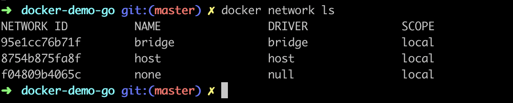

# docker-demo-go

run following command to start golang server

```
go run main.go
```
open browser and hit `localhost:8080` ,you should see `hello` message.
`localhost:8080/healthcheck` ,you should see `running` message

##Docker commands

```text
docker ps
docker ps -a
docker container ls 
docker images
```

Docker run image
```text
docker run test-nginx-docker-ninja
docker run -d --name custom-server test-nginx-docker-ninja
```

get inside container
```text
docker exec -it fbb62e6e37d9 bash
cd /usr/share/nginx/html/
echo "Hi docker ninja" > docker.html
exit
```

commit changes
```text
docker commit testNginx7 test-nginx-docker-ninja
docker images
```

or can use dockerfile.
create dockerfile  
```dockerfile
FROM nginx

WORKDIR /usr/share/nginx/html
RUN echo "hi docker" > docker1.html
```

then build image
```text
docker build -t nginx:auto .
```

##DockerFile
base image

```dockerfile
FROM nginx
```

mkdir /usr/app/src and cd /usr/app/src

```dockerfile
WORKDIR /usr/app/src
```

copy files from host machine to container
using add we can also give url. it will download the file and put it here

```dockerfile
ADD /src/path/from/host /dest/path/to/image
COPY /src/path/from/host /dest/path/to/image
```

pass env variables
```dockerfile
ENV key value
```

execute 
```dockerfile
RUN apt-get install python3 git
```

Expose ports from container from inter container communication
```dockerfile
EXPOSE 8080 9090
```

```dockerfile
CMD ["executable", "param1", "param2", ...]
ENTRYPOINT ["executable", "param1", "param2", ...]
```

#Docker mount: when container is restarted data is not lost. to avoid it we need to mount
1.  Bind mount: any configuration can be added. We need to create the directory and then mount.
2.  Volume mount: docker daemon is responsible in binding the volume. Example: database server
3.  Tmpfs mount: added to memory. temporarily store some data.

Two syntax
1. mount syntax
2. volume syntax


attach volume to container
```text
 docker run --mount type=bind,source=/Users/ashwithabg/docker_ninja/docker-demo,destination=/root --name b1 busybox cat /root/msg.txt

 docker run --mount type=volume,source=any-vol,destination=/root --name bv22 busybox sh -c 'echo "hello volume" >/root/msg1.txt && cat /root/msg1.txt'

 docker run -v /Users/ashwithabg/docker_ninja/docker-demo:/root --name b3 busybox cat /root/msg.txt

 docker run -v any-vol:/root --name b5 busybox cat /root/msg1.txt

 docker run --mount type=bind,source=/Users/ashwithabg/docker_ninja/docker-demo-go,destination=/root --name b3 busybox sh -c 'echo "hello world" > /root/message.txt && cat /root/message.txt'

 docker run -it -v my-volume:/data --name my-container ubuntu:latest

```

detach volume from container
```text
 docker rm -v <container_sha>
```

mount commands
```text
 docker volume create any-vol
 docker volume ls
 docker volume inspect any-vol
 docker volume rm  any-vol
```


Check the location where the volumes are stored
```text
docker run -it --privileged --pid=host justincormack/nsenter1
cd /var/lib/docker/volumes/any-vol/_data/
```

Networking:
`docker network ls`
